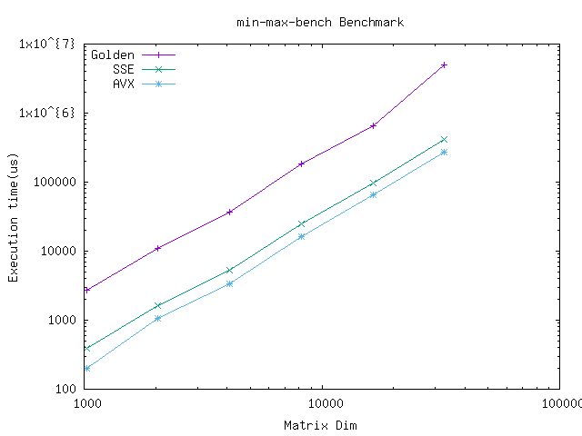
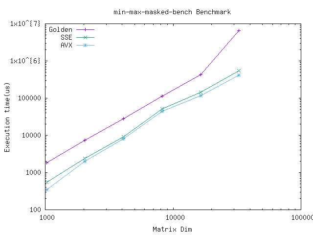

# Casa Case Study

## Build

Pre-requisites: casa
Install using following commands:

```sh
brew tap ska-sa/tap
 brew install casacore
```

-------------

## Performance

1. Min Max SIMD



2. Min Max Masked SIMD


