# Casa Case Study

## Build

Pre-requisites: casa
Install using following commands:

```sh
brew tap ska-sa/tap
brew install casacore
```

## Benchmarking

To run benchmarks:

```sh
# 1. Run make to build project
make
# 2. Run scripts to run benchmarks
bench.sh <executable-to-run>
# or for casa benchmaring
benchCASA.sh
```

-------------

## Performance

### i7-9750H

1. MinMax with OpenMp and SIMD

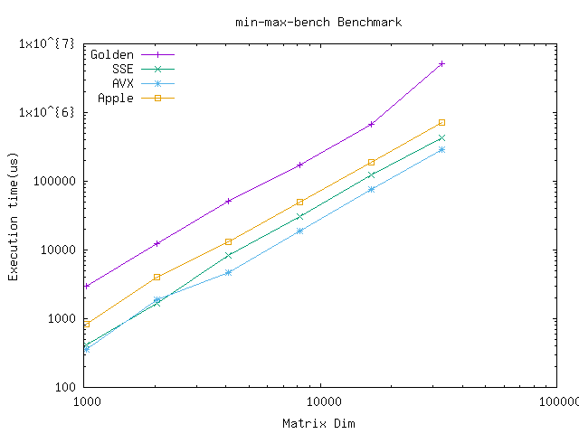

2. MinMaxPos with OpenMp and SIMD

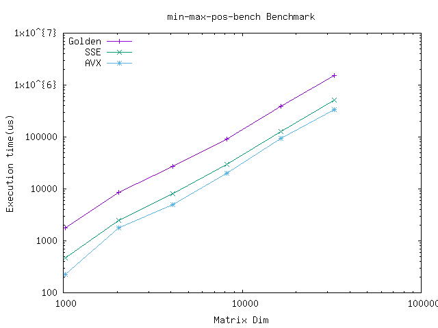

3. MinMaxMasked with OpenMp and SIMD

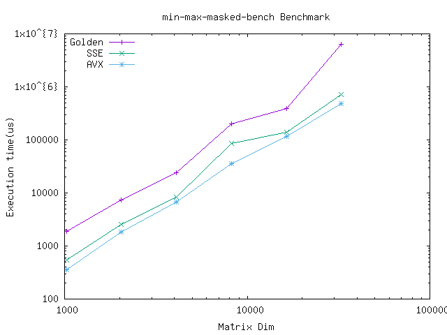

4. Casa benchchmark with Openmp and SIMD

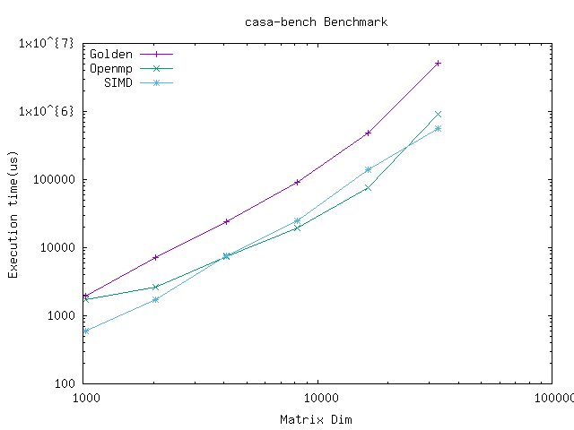

### Ryzen5800X

1. MinMax with OpenMp and SIMD

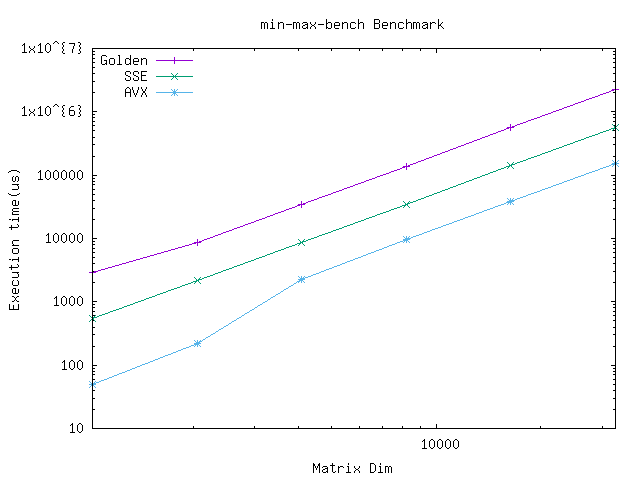

2. MinMaxPos with OpenMp and SIMD

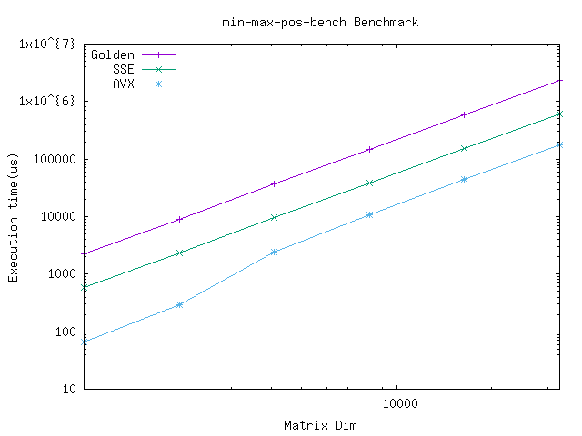

3. MinMaxMasked with OpenMp and SIMD

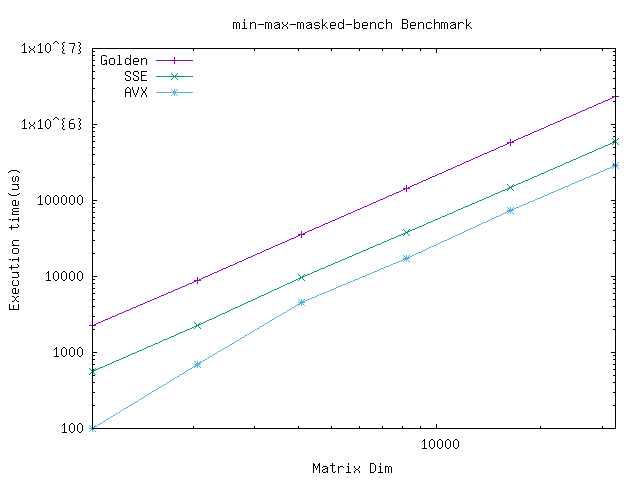

4. Casa benchchmark with Openmp and SIMD

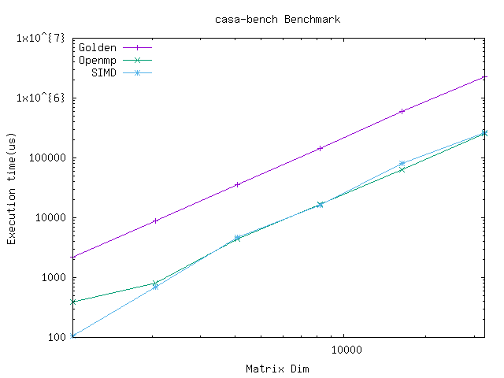

## Energy

### Ryzen 3700X

1. MinMax with OpenMp and SIMD

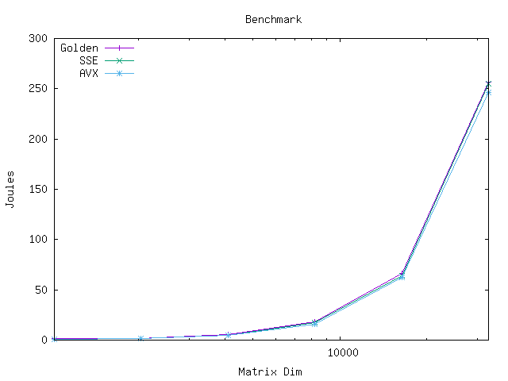

2. MinMaxPos with OpenMp and SIMD

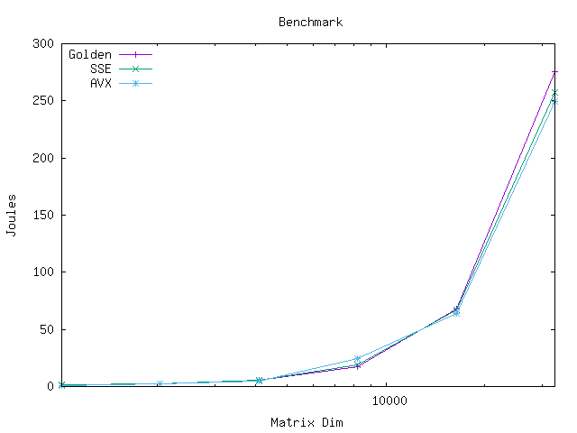

3. MinMaxMasked with OpenMp and SIMD

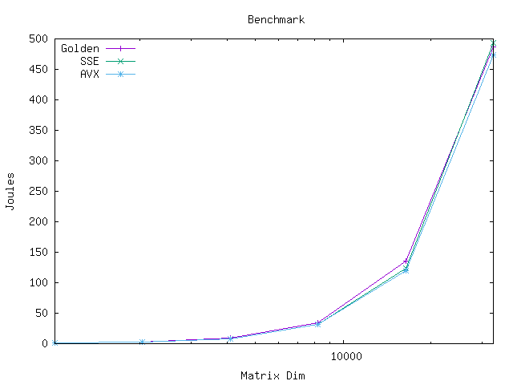

### Ryzen 5800X

1. MinMax with OpenMp and SIMD

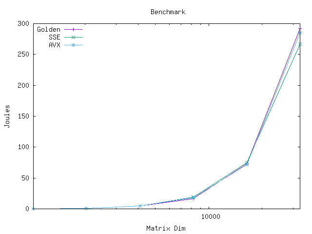

2. MinMaxPos with OpenMp and SIMD

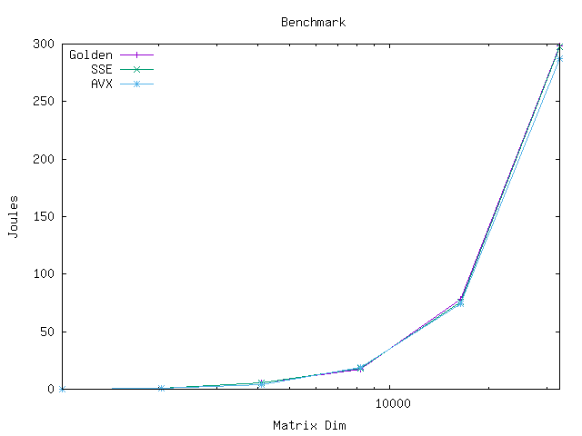

3. MinMaxMasked with OpenMp and SIMD

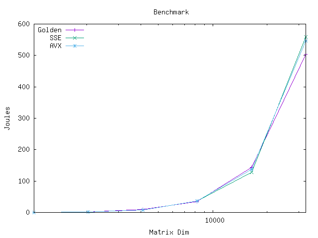

